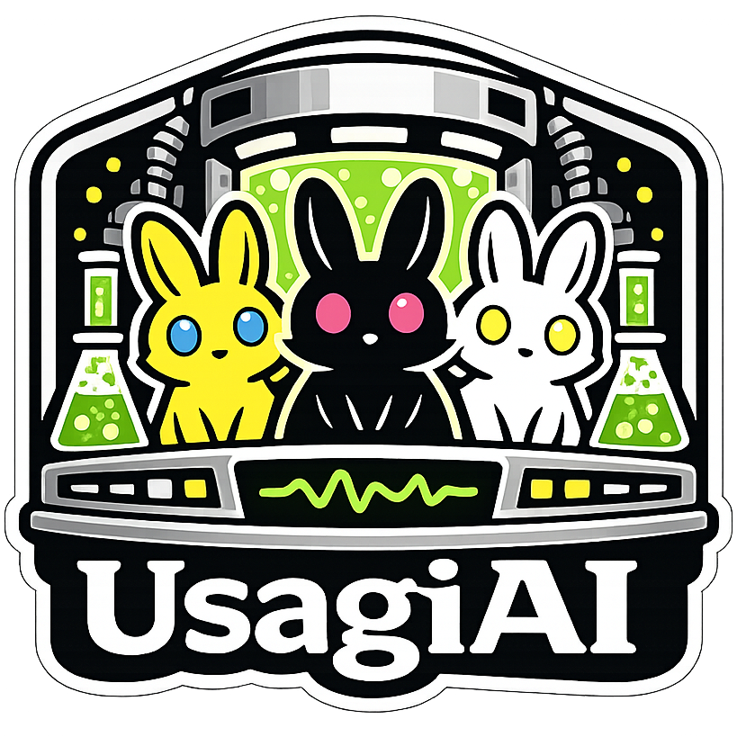

# <div align="center">UsagiAI</div>

<div align="center">

### *The lab is open.*

### *The subjects are contained.*

### *The records are safe.*

### *Mostly.*

</div>

<br>

<div align="center"></div>

<br>

<div align="center"></div>
<div align="center"><a href="https://buymeacoffee.com/waypointnull"></a></div>

---

<div align="center">

## What this is

</div>

UsagiAI is the local desktop hub for my AI tools.

Instead of cramming every project into one increasingly cursed application, each tool lives as its own self-contained resident inside the lab.

UsagiAI isn't the interesting part.

It launches them.

Keeps them alive.

Keeps them isolated.

Stores their records.

Lets them hand those records to the next tool in the pipeline.

Then it quietly gets out of the way.

Every resident gets:

- Its own process.
- Its own port.
- Its own data directory.
- Its own little containment cell.

Close a resident...

...and its process disappears.

The records don't.

---

<div align="center">

## Why?

</div>

Projects have a habit of growing.

You add one feature.

Then another.

Eventually your tag generator somehow depends on your image viewer and nobody remembers why.

I'd rather build small tools that each do one job well.

UsagiAI is the thing that lets them feel like one application without turning them into one.

Every resident can be updated independently.

Restarted independently.

Broken independently.

Which is significantly less stressful than breaking everything simultaneously.

---

<div align="center">

## What this stupid thing actually does

</div>

You install one of the supported tools.

UsagiAI launches it.

Watches it.

Stores anything it decides is worth keeping.

Then makes those records available to other residents later.

More specifically:

* 🧪 **Runs every resident locally.**
* 🔒 **Keeps each tool isolated** with its own process, port and data directory.
* 📚 **Stores history** outside the resident itself.
* 🔄 **Lets tools exchange records** through the local bus.
* 📦 **Installs and updates** supported WaypointNull projects.
* 🩹 **Repairs installations** without making you start over.
* 🖥️ Runs completely locally after setup.

> [!NOTE]
> Everything runs on your own machine.
>
> No cloud.
>
> No accounts.
>
> No API keys.
>
> No telemetry.
>
> Just a mildly concerning laboratory in your taskbar.

---

<div align="center">

## How the lab works

*(It's mostly paperwork.)*

</div>

```text
Resident starts.

        │
        ▼

UsagiAI gives it
a port and data directory.

        │
        ▼

The resident
does its job.

        │
        ▼

It files a record
with the hub.

        │
        ▼

The hub archives it.

        │
        ▼

Another resident
can read it later.
```

Residents never communicate directly.

Only records cross the boundary.

Everything else stays contained.

Because tightly coupled software is how horror stories begin.

---

<div align="center">

## The residents

</div>

Every resident is a self-contained application with a `plugin.json` manifest.

UsagiAI doesn't care how it's built internally.

It launches it.

Checks whether it's alive.

Hands it a few environment variables.

Then leaves it alone.

The current resident is:

**Akumu**

Natural language in.

Verified Danbooru tags out.

The planned pipeline looks something like:

```text
Akumu (tags)
        │
        ▼
Tsuki (tag refinement)
        │
        ▼
Akira (image generation)
```

Eventually there may be a few utility residents too.

Things like model management, Ollama setup, and other boring infrastructure that deserves its own room instead of cluttering everything else.

The goal isn't to become an app store.

It's to keep one ecosystem tidy.

---

<div align="center">

## The archive

</div>

History belongs to the hub.

Not the resident.

Every record gets written to:

```text
data/history/<plugin-id>/<schema>.jsonl
```

Restart the resident.

History stays.

Restart the hub.

History stays.

Delete the process.

Still there.

Only RAM has commitment issues.

Records are versioned from day one:

```text
name@major
```

For example:

```text
tag-list@1
```

Breaking changes create new versions instead of quietly breaking old ones.

Future me deserves at least *some* sympathy.

---

<div align="center">

## The bus

</div>

Residents communicate through a local HTTP bus owned by the hub.

Not with each other.

Only records are allowed through.

Typical endpoints include:

```text
POST /bus/history

GET /bus/history/latest

GET /bus/history
```

Authentication uses per-resident tokens.

The SDK handles the annoying parts.

A resident can still run by itself.

It simply won't notice the lab isn't there.

---

<div align="center">

## The Store

*(The intake department.)*

</div>

The Store installs and updates software built for UsagiAI.

Right now that's WaypointNull projects.

Later it may also distribute things like curated AI models or setup helpers.

It isn't trying to become an app marketplace.

It's a package shelf for this particular lab.

Install.

Update.

Repair.

Uninstall.

If you're already on the newest version...

...it'll tell you.

The lab likes keeping accurate records.

---

<div align="center">

## Requirements

</div>

You'll need:

* Node.js 18+
* At least one resident

Some residents have additional requirements.

Akumu, for example, expects Ollama and a downloaded model.

That's Akumu's department.

It'll complain loudly if something's missing.

---

<div align="center">

## Run it

</div>

```powershell
npm install
npm run build
npm start
```

Then open:

```text
http://127.0.0.1:5178
```

Congratulations.

You now have another localhost tab you'll eventually wonder where the CPU usage came from.

Prefer an actual desktop window?

```powershell
npm run dev
```

That launches the Electron shell instead.

A proper home for the lab.

---

<div align="center">

## The layout

</div>

```text
src/
    The hub.
    Starts residents.
    Stops residents.
    Keeps the lights on.

client/
    The observation deck.

plugins/
    The resident applications.

sdk/
    What residents use to talk to the hub.

data/
    Records, caches, working files, and other things Git politely ignores.
```

---

<div align="center">

## It broke.

</div>

**A resident won't start.**

Read the error.

Really.

It's almost always missing dependencies or a health endpoint that never answered.

---

**The Store won't install something.**

That release probably predates UsagiAI or doesn't include the metadata it needs.

Not everything belongs in the lab.

---

**The records disappeared.**

They almost certainly didn't.

Look inside:

```text
data/history/
```

Processes are temporary.

The archive isn't.

---

**A resident forgot everything after restarting.**

Good.

That's intentional.

Persistent state belongs to the hub.

---

<div align="center">

## License

WaypointNull Community License v1.0

Use it.

Fork it.

Modify it.

Just don't make money off my suffering.

</div>